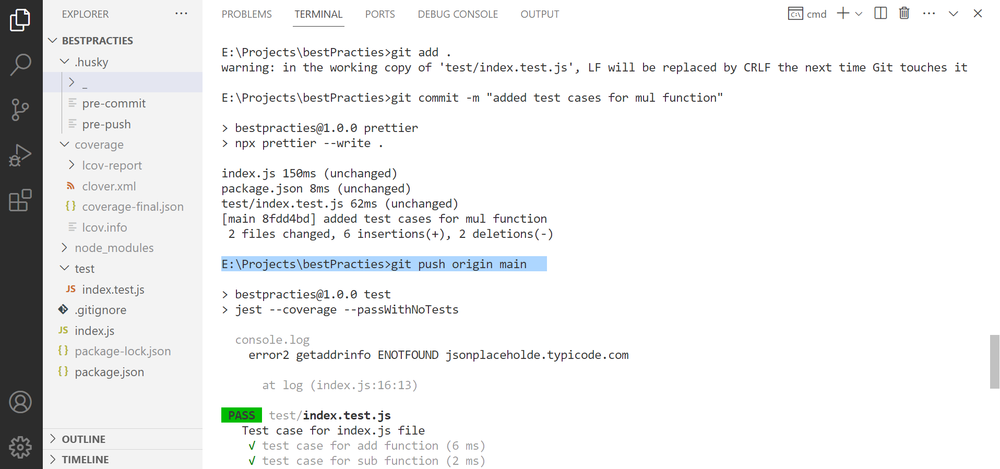
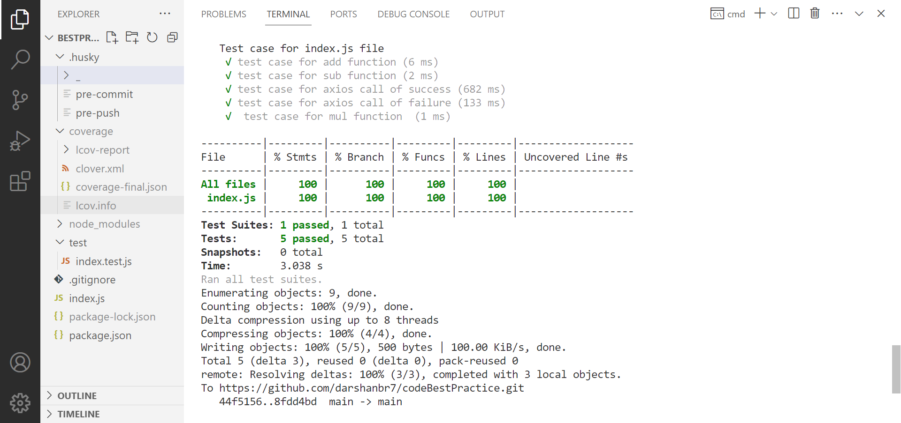

## Best Practies

- using jest package to write test cases for sync and async function
- using husky package to run prettier,test cases before commit and push
- using prettier to prettify the code

## Packages used

- jest
- husky
- prettier

**Below are the ScreenShot of working husky,prettier and jest**

